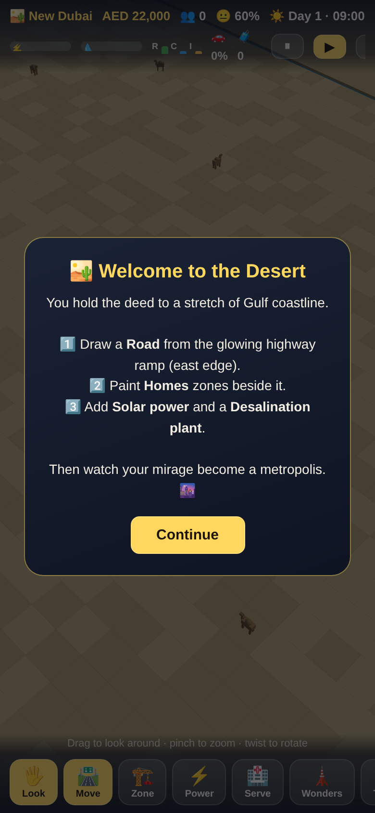
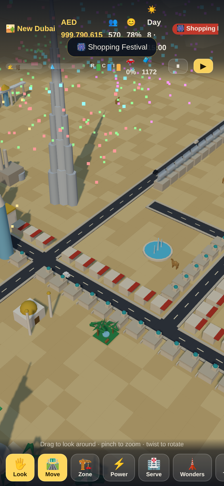
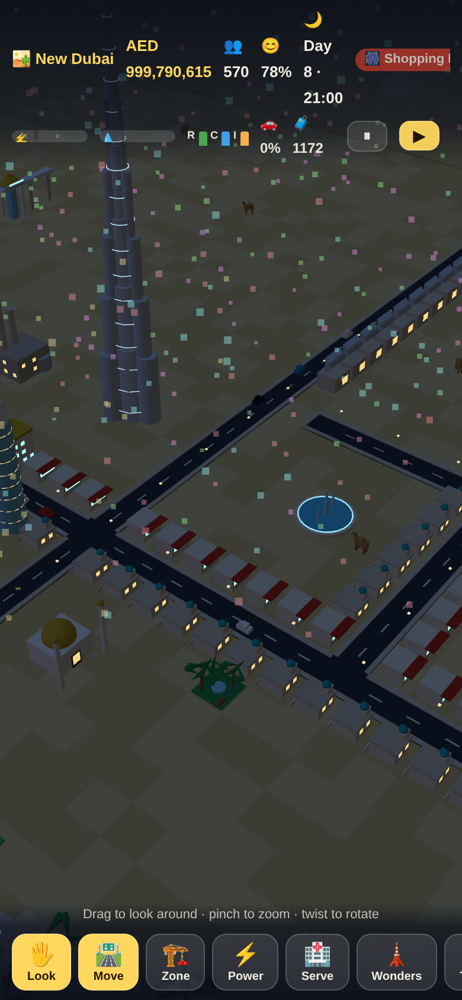

# 🏜️ Mirage City: Dubai

A 3D, Dubai-themed city-building simulator that runs entirely in your browser —
designed for one-thumb play on an iPhone. No app store, no build step, no
server: pure JavaScript + Three.js.

| Welcome | Day | Night |
| --- | --- | --- |
|  |  |  |

## ▶️ Play it on your iPhone

1. **Host it** (any static host works):
   - **GitHub Pages (recommended):** repo **Settings → Pages → Source: GitHub Actions**.
     The included workflow (`.github/workflows/pages.yml`) deploys automatically on
     every push to `main`. Your game will live at
     `https://<your-username>.github.io/citysim/`.
   - Or locally on your network: `python3 -m http.server` in the repo, then open
     `http://<your-computer-ip>:8000` in iPhone Safari.
2. Open the URL in **Safari** on your iPhone.
3. Tap **Share → Add to Home Screen**. It installs like an app: full-screen,
   offline-capable (service worker caches everything), with its own icon.

## 🎮 How to play

- **Look around:** one-finger drag pans · pinch zooms · twist two fingers to rotate.
- **Build:** pick a tool from the bottom bar. Drag to paint roads/zones/metro;
  tap to place buildings. With a tool selected, use **two fingers** to move the camera.
- **Start here:** draw a road from the **glowing highway ramp** on the east edge,
  paint 🏠 Homes beside it, then add ☀️ Solar power and a 💧 Desalination plant
  (it must touch the sea). The desert takes care of the rest.
- **Inspect:** the 🔍 tool (or Look mode tap) tells you what any tile is feeling.

## 🌆 Features

- **Full 3D city** with a day/night cycle — windows and streetlights glow after dusk.
- **Zoning that grows:** desert villas → apartment blocks → marina towers, driven by
  demand (R/C/I), services and happiness.
- **Traffic simulation:** every car routes over your real road network; jams slow
  them down and annoy your citizens. Toggle the 🌡️ heatmap to find bottlenecks.
- **Elevated Dubai Metro:** drag track, add stations, watch the train run.
  Citizens near connected stations leave the car at home.
- **Utilities & services:** solar farms, gas plants, desalination (coast-only),
  water towers, schools, clinics, police, fire, mosques, parks, souks — all with
  coverage radii that gate building level-ups.
- **Seven Wonders of Dubai:** Dancing Fountain, Dubai Frame, Burj Al Arab (builds
  in the sea), Museum of the Future, Dubai Mall, **Palm Island** (tap open water to
  reclaim a palm-shaped island you can build on!) and the **Burj Khalifa** — each
  unlocked by population milestones, each pulling in tourists.
- **Economy:** dirham budget, daily taxes vs. maintenance, tourism income,
  goal rewards and milestone bonuses.
- **Desert life & drama:** wandering camels, dhows sailing the Gulf,
  **sandstorms**, heatwaves, shopping festivals, and fireworks over your skyline
  when you hit a milestone.
- **Quality of life:** autosave to localStorage, tutorial goals (🎯), inspect
  panel, sound effects (mutable), automatic performance mode on older phones.

## 🛠️ Development

Plain ES modules — edit and refresh. Three.js is vendored in `vendor/`.

```bash
# logic test-suite (headless, no browser needed)
node tools/smoke.js

# full end-to-end render test (needs puppeteer installed e.g. in /tmp/node_modules)
node tools/browser_test.js

# regenerate the app icons
node tools/gen_icons.js
```

| Path | What lives there |
| --- | --- |
| `src/constants.js` | grid, building catalog, balance numbers |
| `src/simulation.js` | the city brain: growth, economy, events, goals |
| `src/roads.js` / `src/traffic.js` | road graph, BFS routing, cars, metro train |
| `src/buildings.js` | every procedural building, merged into 2 draw calls |
| `src/terrain.js` | desert, sea, coast, palms, camels, dhows |
| `src/effects.js` | day/night, sandstorms, fireworks, synth sounds |
| `src/input.js` | touch camera + paint gestures |
| `src/ui.js` | HUD, toolbar, panels |
